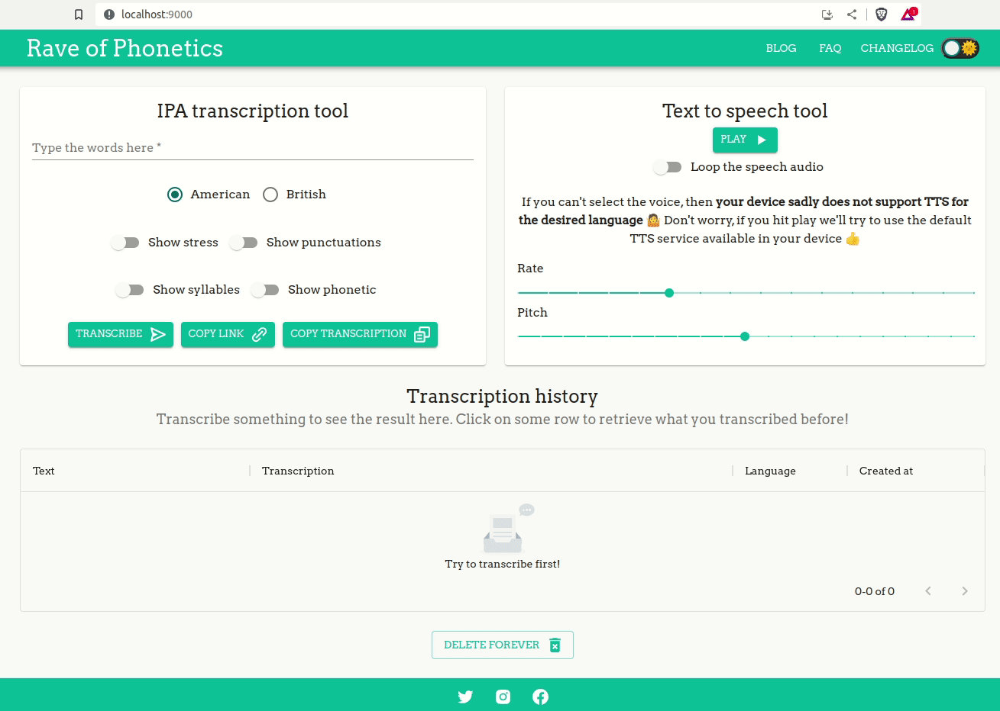

# Rave of Phonetics

Do you need help making the TH sound? Do you want to say the word thought correctly? By using phonetics, you can learn it by yourself, with practice. This project helps you in this aspect. Let's start learning!

## A very brief details about this project

It used to run at `raveofphonetics.com`. It was built to compete against `tophonetics.com`. When this README was written, the former website was still terrible regarding UX and collaboration. It was one of the things I'd like to improve with this project. Unfortunately, I didn't have time to keep up with it.

The [first version](https://github.com/willianantunes/rave-of-phonetics/releases/tag/1.0.0) of this project used to run on Cloud Run. After the release of the second version, this time, it was running on Kubernetes. Soon I'll release the manifest also and update the repository.

## Running the project

Access the `backend` folder and execute:

    docker-compose up remote-interpreter

Access the `frontend` folder and execute:

    docker-compose up blog

When they are up, access the link `http://localhost:9000/` for the front-end project.

For the Django Admin, access the address `http://localhost:8000/logos` with the credential `admin:admin`:

    
## Similar tools

- [To Phonetics](https://tophonetics.com/)
- [Elsa Speak](https://elsaspeak.com/en/)
- [Phonetizer](https://phonetizer.com/ui)
- [Unalengua](https://unalengua.com/ipa?hl=en&sl=en)
